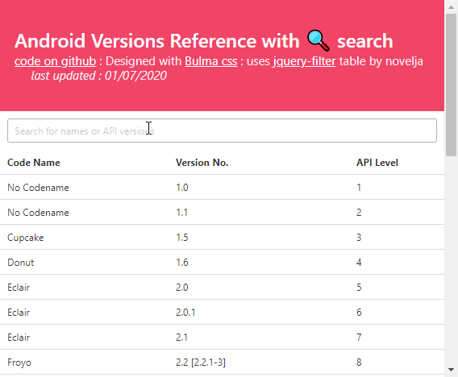

# Easy Android Dev Reference

*Which is Android API 25 ? What version is Android Lollipop ?*

A Quick and Easy Web reference site for Android Developers (Checking API versions, so on and so forth)

# [View Website](https://monsterbrain.github.io/EasyAndroidDevReference/)

## Libraries Used

- [Filter Table](https://github.com/novelja/filter-table) by [novelja](https://github.com/novelja)
- [Bulma CSS](https://bulma.io/)
- [JQuery](https://jquery.com/)
